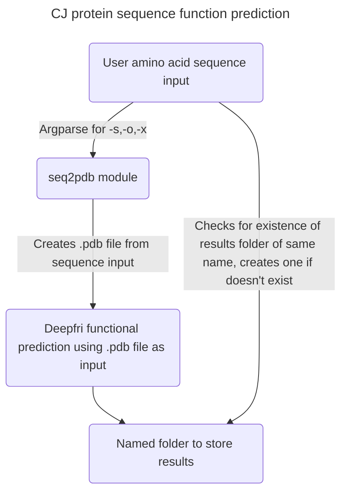

## Predict protein molecular function, biological process, cellular component, Enzyme commission with an amino acid sequence
I have created a python script which streamlines the usage of Deepfri on a CPU by using a protein sequence input (Deepfri sequence input prediction is currently bugged).
The python scripts utilise two programs, seq2pdbchain and Deepfri. Seq2pdbchain converts the amino acid sequence input into a pdb file, which is then used as input for deepfri.
* Seq2pdbchain: https://github.com/pb1729/seq2pdbchain/tree/master
* Deepfri: https://github.com/flatironinstitute/DeepFRI

## Usage
Run the python script with:
python CJ_deepfri_from_seq.py {-args}
args:
* -s, --sequence: Paste amino acid sequence here without the ending * (required)
* -o, --output: Name of the protein for output files
* -x, --additional_args: Any additional arguments which are to be passed to Deepfri

## Modifications to seq2pdb or Deepfri
seq2pdbchain.py has been modified to:
* import argparse
* from CJ_argparse import args
* The last line has been changed to print(pdb_chain(args.sequence)) to take in the args.sequence from CJ_argparse

